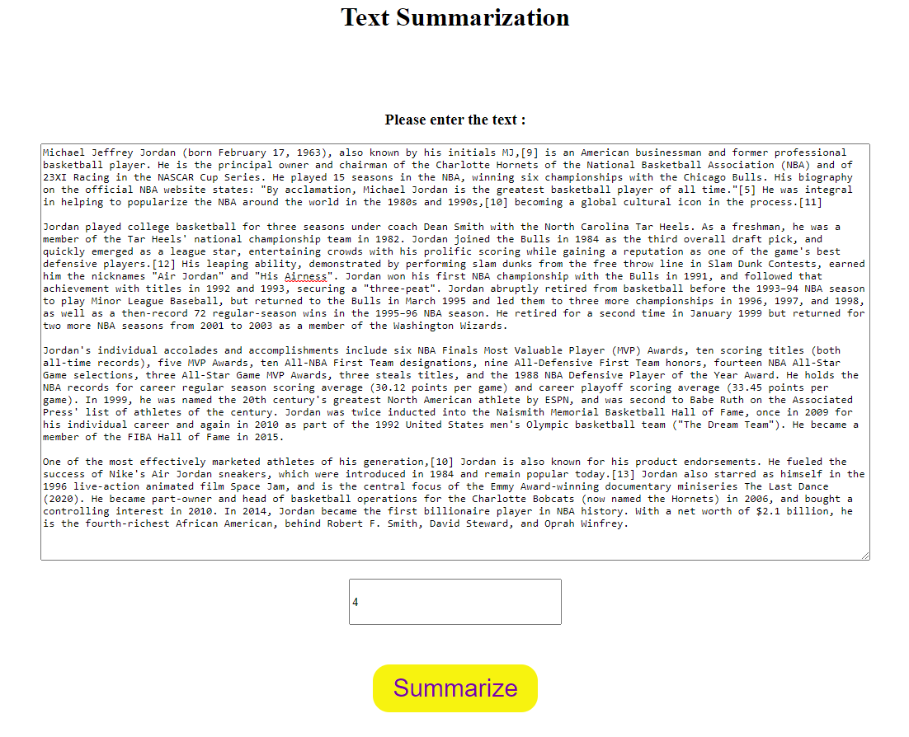
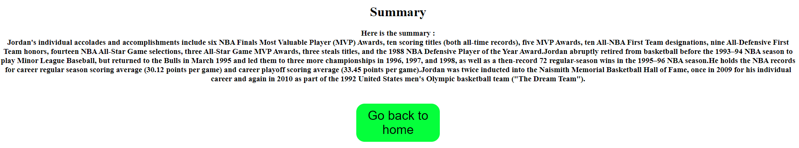

# Simple-Text-Summarizer

<h3> This is a simple text summarizer using Spacy </h3>
 
Build an end to end summarizer model and deploy it for better user experience.

- In the notebook, you will find a simple system on how to summarize an article. 
- Here, you will able to choose how many sentences you want your summary will be. 
- The summary is taken from weight of each sentences.  
- The importance of the sentences is weighted from each word's frequency of appearance  

You can try to use my simple summarizer : 
<a href='https://jo-text-summarization.herokuapp.com/'>Johan's Simple Summarizer</a>

How to use :
1. Copy and paste an article you want to summarize ( for the example I took Michael Jordan article from Wikipedia )
2. Pick how many sentences you want your article to be summarized ( I choose to summarize it into 4 sentences )

 
3. Click Summarize 

<h3> The Result </h3>

#### Thank you
#### Happy Coding
